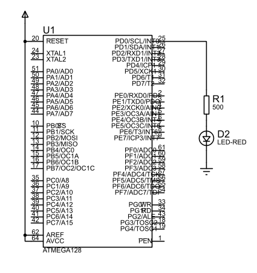

# Embedded Systems 101: Blinking a LED

Since we know understand how to program the AVR pins, we can now blink a LED. This project is the hello world for embedded systems.

## Components

- [ATMEGA328P](https://www.sparkfun.com/products/11021)
- [LED](https://www.sparkfun.com/products/106)
- [Resistor](https://www.sparkfun.com/products/12006)
- [Breadboard](https://www.sparkfun.com/products/12002)
- [Breadboard Jumper Wires](https://www.sparkfun.com/products/12001)

## Circuit



## Code

```c
#include <avr/io.h>
#include <util/delay.h>

int main(void) {
    DDRD |= (1 << DDD0); // Set PB5 as output

    while (1) {
        PORTB |= (1 << PD0); // Set PB5 high
        _delay_ms(1000); // Wait 1000ms

        PORTB &= ~(1 << PD0); // Set PB5 low
        _delay_ms(1000); // Wait 1000ms
    }
}
```

Note how we have our program structured. We can divide our program into two logical parts: configuration and system loop. The configuration part is where we set up our system. In this case, we are setting up the pin that we are going to use to blink the LED. The system loop is where we run our program. In this case, we are blinking the LED.

We have a `while` loop that will run forever. Inside the loop, we set the LED high, wait 1000ms, set the LED low, and wait 1000ms. This will cause the LED to blink.
