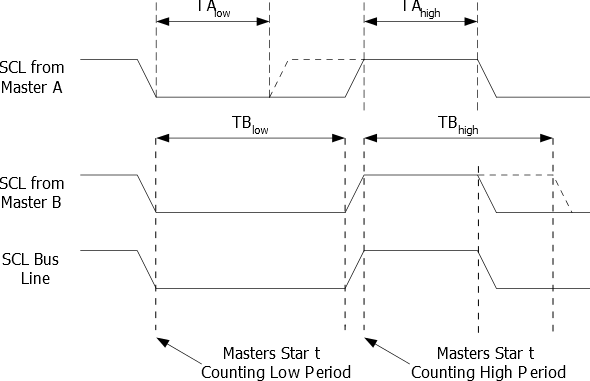
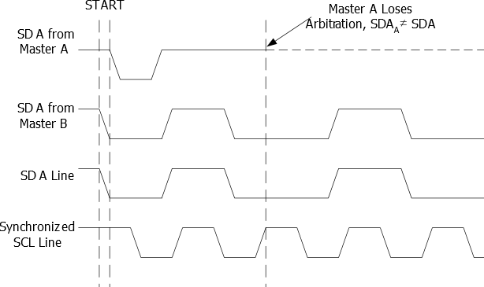

# I2C (Inter Integrated Circuit)

I2C is a serial communication protocol that allows multiple devices to communicate with each other. It is a multi-master, multi-slave, single-ended, serial, half-duplex, packet-switched, synchronous serial communication protocol.

It is a two-wire protocol that uses two lines, SDA (Serial Data) and SCL (Serial Clock). The SDA line is used for data transfer and the SCL line is used for clocking.

The SDA line is bidirectional and the SCL line is unidirectional. The SCL line is used to synchronize data transfer on the SDA line. The SCL line is always driven by the master device and the SDA line is driven by both the master and the slave devices. Both the SDA and SCL lines are pulled high by pull-up resistors because both lines are **active low**.

I2C is usually used to connect low speed devices like EEPROMs, ADCs/DACs, I/O interfaces, sensors, RTCs, etc. to a microcontroller. It is also used to connect multiple microcontrollers to each other.

## I2C Features

- Simple, yet Powerful and Flexible Communication Interface, only two Bus Lines Needed
- Both Master and Slave Operation Supported
- Device can Operate as Transmitter or Receiver
- 7-bit Address Space Allows up to 128 Different Slave Addresses
- Multi-master Arbitration Support
- Up to 400kHz Data Transfer Speed
- Slew-rate Limited Output Drivers
- Noise Suppression Circuitry Rejects Spikes on Bus Lines
- Fully Programmable Slave Address with General Call Support
- Address Recognition Causes Wake-up When AVR is in Sleep Mode

## I2C Bus

The I2C bus consists of two lines, SDA and SCL. The SDA line is bidirectional and the SCL line is unidirectional. The SCL line is used to synchronize data transfer on the SDA line. The SCL line is always driven by the master device and the SDA line is driven by both the master and the slave devices. Both the SDA and SCL lines are pulled high by pull-up resistors because both lines are **active low**.

## I2C Frame

The I2C frame consists of a start bit, 7-bit address, a read/write bit, 8-bit data, and a stop bit.

### Start Bit

The start bit is a logic high to low transition on the SDA line while the SCL line is high. It indicates the start of a new frame.

### 7-bit Address

The 7-bit address is used to identify the slave device. The 7-bit address is followed by a read/write bit. The 7-bit address is sent by the master device and the slave device acknowledges it by pulling the SDA line low.

### Read/Write Bit

The read/write bit is used to indicate whether the master device wants to read from or write to the slave device. If the read/write bit is 0, the master device wants to write to the slave device. If the read/write bit is 1, the master device wants to read from the slave device.

### 8-bit Data

The 8-bit data is sent by the master device and the slave device acknowledges it by pulling the SDA line low.

### Stop Bit

The stop bit is a logic low to high transition on the SDA line while the SCL line is high. It indicates the end of a frame.

## I2C Bit Generator Unit

This unit controls the period of SCL when operating in a Master mode. The SCL period is controlled by settings in the TWI Bit Rate Register (TWBR) and the Prescaler bits in the TWI Status Register (TWSR). Slave operation does not depend on Bit Rate or Prescaler settings, but the CPU clock frequency in the Slave must be at least 16 times higher than the SCL frequency. Note that slaves may prolong the SCL low period, thereby reducing the average TWI bus clock period.

The SCL frequency is generated according to the following equation:

$$ f_{SCL} = \frac{f_{CPU}}{16 + 2 \times TWBR \times 4^{TWPS}} $$

where $f_{CPU}$ is the CPU clock frequency and $TWBR$ and $TWPS$ are the values of the TWI Bit Rate Register and the TWI Prescaler bits in the TWI Status Register respectively.

## Multi-Master Arbitration

In I2C, multiple master devices can be connected to the same bus. Multi-master arbitration is the mechanism by which these devices can communicate with each other in an orderly fashion, without interfering with each other's communications.

**Arbitration** refers to the process by which two or more devices compete for control of the bus. In I2C, each device has a unique address, and when it wants to communicate with another device on the bus, it first sends out a message containing its address. If multiple devices try to transmit messages at the same time, their messages will collide and corrupt each other.

**Two problems arise in a multi-master system:**

1. **Bus contention**: When two or more masters try to transmit messages at the same time, their messages will collide and corrupt each other.
An algorithm must be implemented allowing only one of the masters to complete the transmission. All other masters should cease transmission when they discover that they have lost the selection process. This selection process is called arbitration. When a contending master discovers that it has lost the arbitration process, it should immediately switch to Slave mode to check whether it is being addressed by the winning master. The fact that multiple masters have started transmission at the same time should not be detectable to the slaves, i.e. the data being transferred on the bus must not be corrupted.

2. **Different SCL frequencies**: The SCL frequency of each master device may be different from the SCL frequency of the other master devices.
A scheme must be devised to synchronize the serial clocks from all masters, in order to let the transmission proceed in a lockstep fashion. This will facilitate the arbitration process.

In the ATMEGA series of microcontrollers, ANDing the bus lines solve these problems. The serial clocks from all masters will be wired-ANDed, yielding a combined clock with a high period equal to the one from the Master with the shortest high period. The low period of the combined clock is equal to the low period of the Master with the longest low period. Note that all masters listen to the SCL line, effectively starting to count their SCL high and low time-out periods when the combined SCL line goes high or low, respectively.

Arbitration is carried out by all masters monitoring the SDA line after outputting data. If the value read from the SDA line does not match the value the master had output, it has lost the arbitration. The losing master will immediately stop driving the bus and switch to a slave mode, listening for further commands. The winning master can continue to drive the bus and complete its transaction.

## I2C Registers

The I2C registers are:

- TWBR: TWI Bit Rate Register
- TWSR: TWI Status Register
- TWAR: TWI (Slave) Address Register
- TWDR: TWI Data Register
- TWCR: TWI Control Register

### TWI Bit Rate Register (TWBR)

The TWI Bit Rate Register (TWBR) is used to set the bit rate of the TWI. The bit rate is set by writing a value to the TWBR register.

TWBR selects the division factor for the bit rate generator. The bit rate generator is a frequency divider which generates the SCL clock frequency in the Master modes. See Bit Rate Generator Unit for calculating bit rates.

### TWI Status Register (TWSR)

#### Bits 7:3 – TWSn: TWI Status Bit 7 [n = 7:3]

#### Bits 1:0 – TWPSn: TWI Prescaler Bits 2 [n = 1:0]

These bits can be read and written, and control the bit rate prescaler.

TWPS1|TWPS0|Prescaler Value
:--:|:--:|:--:
0|0|1
0|1|4
1|0|16
1|1|64

### TWI (Slave) Address Register (TWAR)

### TWI Data Register (TWDR)

### TWI Control Register (TWCR)