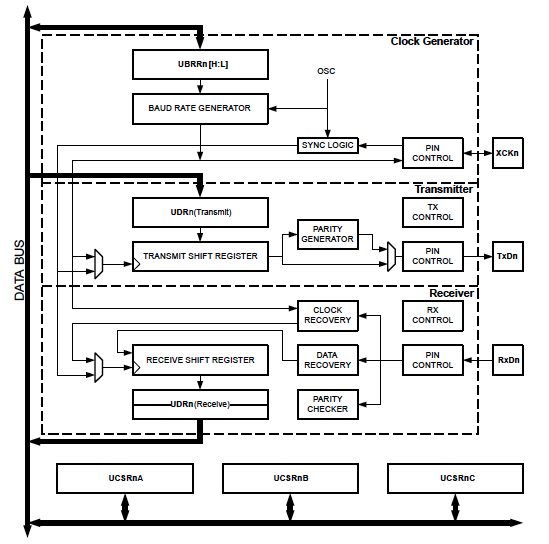

# USART / UART

Universal Synchronous/Asynchronous Receiver/Transmitter or UART for short represents the hardware circuitry (module) being used for serial communication. UART is sold/shipped as a standalone integrated circuit (IC) or as an internal module within microcontrollers.

There are two forms of UART hardware:

- UART – Universal Asynchronous Receiver/Transmitter
- USART – Universal Synchronous/Asynchronous Receiver/Transmitter

The Synchronous type of transmitters generates the data clock and sends it to the receiver which works accordingly in a synchronized manner. On the other hand, the Asynchronous type of transmitter generates the data clock internally. There is no incoming serial clock signal, so in order to achieve proper communication between the two ends, both of them must be using the same **baud rate**.

Like many microcontrollers AVR has a dedicated hardware for USART.

This special hardware make your life as programmer easier. You just have to supply the data you need to transmit and it will do the rest.

## USART Hardware Achitecture

A typical architecture of USART hardware in the avr microcontroller is shown below.

Source: [Microchip](https://microchipdeveloper.com/8avr:avrusartintro)

Note that AVR may has multiple channels (depending on which ATMEGA version you're using) for USART. This means that you can have multiple USART channels in your microcontroller. Each channel has its own set of registers. Each channel is denoted by `n`. For example, `UART0` is the peripheral for USART channel `0`.

### USART Registers

As a software engineer you don't have to be concerned with the intricate details of the hardware. You just have to know how to use it. The following table shows the registers used for USART.

| Register | Description |
| -------- | ----------- |
| UDR | USART I/O Data Register |
| UCSRA | USART Control and Status Register A |
| UCSRB | USART Control and Status Register B |
| UCSRC | USART Control and Status Register C |

Checkout the datasheet for more details on the registers: [USART Register Description | Microchip](https://onlinedocs.microchip.com/pr/GUID-80B1922D-872B-40C8-A8A5-0CBE009FD908-en-US-3/index.html?GUID-F721DB7D-EB3A-490F-A762-AA8C7CC06CD5)

#### UDR – USART I/O Data Register

The UDR register is used to read and write data to the USART.

The USART Transmit Data Buffer Register and USART Receive Data Buffer Registers share the same I/O address referred to as USART Data Register or `UDR`.

#### USART Control and Status Register A (UCSRA)

The UCSRA register is used to control the USART and provide status flags. The following table shows the bits in the register.

| Bit | Description |
| --- | ----------- |
| MPCM | Multi-processor Communication Mode |
| U2X | Double the USART Transmission Speed |
| UPE | Parity Error |
| DOR | Data overRun |
| FE | Framing Error |
| UDRE | USART Data Register Empty |
| TXC | USART Transmitt Complete |
| RXC | USART Receive Complete |

#### USART Control and Status Register B (UCSRB)

The UCSRB register is used to control the USART. The following table shows the bits in the register.

| Bit | Description |
| --- | ----------- |
|RXCIE | RX Complete Interrupt Enable |
| TXCIE | TX Complete Interrupt Enable |
| UDRIE | USART Data Register Empty Interrupt Enable |
| RXEN | Receiver Enable |
| TXEN | Transmitter Enable |
| UCSZ2 | Character Size |
| TXB8 | Transmit Data Bit 8 |
| RXB8 | Receive Data Bit 8 |

#### USART Control and Status Register C (UCSRC)

The UCSRC register is used to control the USART. The following table shows the bits in the register.

| Bit | Description |
| --- | ----------- |
| UMSEL | USART Mode Select |
| UPM0 | Parity Mode |
| UPM1 | Parity Mode |
| USBS | Stop Bit Select |
| UCSZ0 | Character Size |
| UCSZ1 | Character Size |
| UCPOL | Clock Polarity |

#### USART Baud Rate Register (UBRR)

The UBRR register is used to set the baud rate of the USART. The following table shows the bits in the register.

| Bit | Description |
| --- | ----------- |
| UBRRH | USART Baud Rate Register High |
| UBRRL | USART Baud Rate Register Low |

## USART Interfacing

## References

- [Interrupt-driven UART Library for 8-bit AVR](https://onlinedocs.microchip.com/pr/GUID-80B1922D-872B-40C8-A8A5-0CBE009FD908-en-US-3/index.html?GUID-F721DB7D-EB3A-490F-A762-AA8C7CC06CD5)