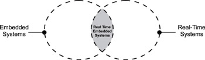
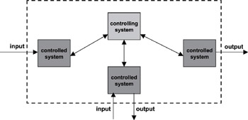

# Introduction to Real-time Embedded Systems

## Introduction

A real-time systems can be defined as those systems that respond to external events in a timely fashion.

External events can have synchronous or asynchronous characteristics. Responding to external events includes recognizing when an event occurs, performing the required processing as a result of the event, and outputting the necessary results within a given time constraint. Timing constraints include finish time, or both start time and finish time.

A good way to understand the relationship between real-time systems and embedded systems is to view them as two intersecting circles:

## Real-time Systems

The environment of the real-time system creates the external events. These events are received by one or more components of the real-time system. The response of the real-time system is then injected into its environment through one or more of its components.

A real-time system consists of a controlling system and at least one controlled system.

The controlling system interacts with the controlled systems in various ways:

* **Periodically**, the communication is, in this case, the communication is predictable and occurs at predefined intervals.
* **Sporadically**, the communication is unpredictable and occurs at irregular intervals and is determined by the random occurrences of external events in the environment of the controlled system.
* Finally, the communication can be **a combination of both types**. The controlling system must process and respond to the events and information generated by the controlled system in a guaranteed time frame.

### Example: A Real-time Weapons Defense System

Consider a weapons defense system whose role is to protect a naval destroyer by shooting down incoming missiles before it reaches the ship. The weapons system is comprised of a rader system, a command-and-decision (C&D) system, and weapons firing control system.

* The controlling system is the C&D system. The C&D system receives information from the radar system and determines whether or not to fire the weapons. The radar system scans and searches for potential targets. Coordinates of a potential target are sent to the C&D system periodically with high frequency after the target is acquired.
* The C&D must determine the threat level of the target and decide whether or not to fire the weapons. If a threat is imminent, the C&D system must, at a minimum, calculate the speed and flight path or trajectory, as well as estimate the impact location.
* The C&D system then activates the weapons firing control system closest to the anticipated impact location and guides the weapons system to fire continuously within the moving area or box until the target is destroyed. The weapons firing control system is comprised of large-caliber, multi-barrel, high-muzzle velocity, high-power machine guns.

In this example, the communication between the C&D system and the radar system is aperiodic, because the occurance of a potential target is not predictable.
The communication betwee the C&D and the weapons firing control system is periodic, because the C&D system feeds the firing coordinates into the weapons control system periodically.

## Characteristics of Real-time Systems

Real-time systems have the following characteristics:

* Real-time systems are defined as those systems in which the overall correctness of the system depends on both **the functional correctness and the timing correctness**. The timing cor-rectness is at least as important as the functional correctness.

* Similar to embedded systems, real-time systems also have substantial knowledge of the environment of the controlled system and the applications running on it. This reason is one why many real-time systems are said to be deterministic, because in those real-time systems, the response time to a detected event is bounded. The action (or actions) taken in response to an event is known a priori.

## Hard and Soft Real-time Systems

Real-time systems can be classified into two categories: hard real-time systems and soft real-time systems.

* **Hard real-time systems** are those systems in which the timing constraints are **strictly enforced**. If the timing constraints are not met, the system is considered to have failed. Examples of hard real-time systems include avionics, space systems, and weapons systems.
* **Soft real-time systems** are those systems in which the timing constraints are **not strictly enforced**. If the timing constraints are not met, the system is not considered to have failed. Examples of soft real-time systems include video games, video conferencing, and interactive multimedia.

**What defines the deadline for a hard real-time system?**

It is the penalty. For a hard real-time system, the deadline is a **deterministic** value, and, for a soft real-time system, the value can be **estimation**.
